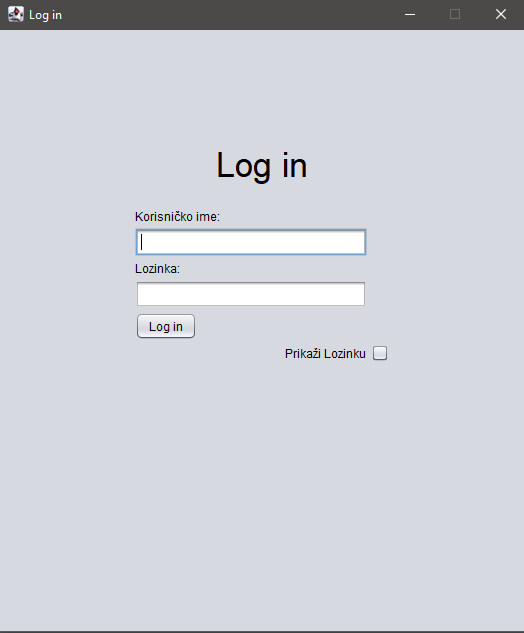
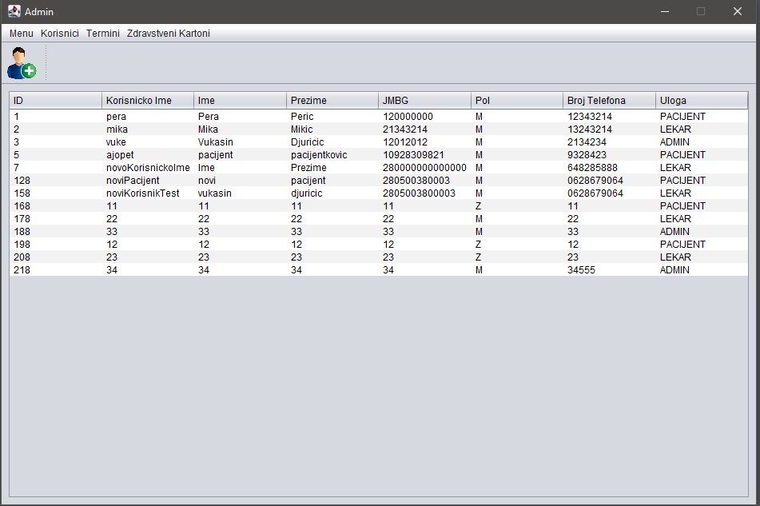
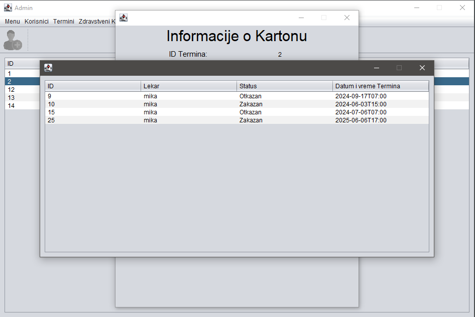
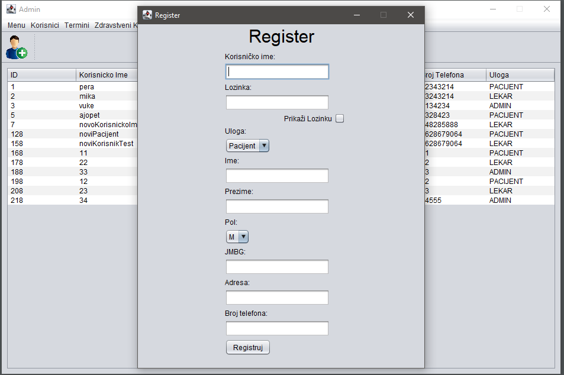
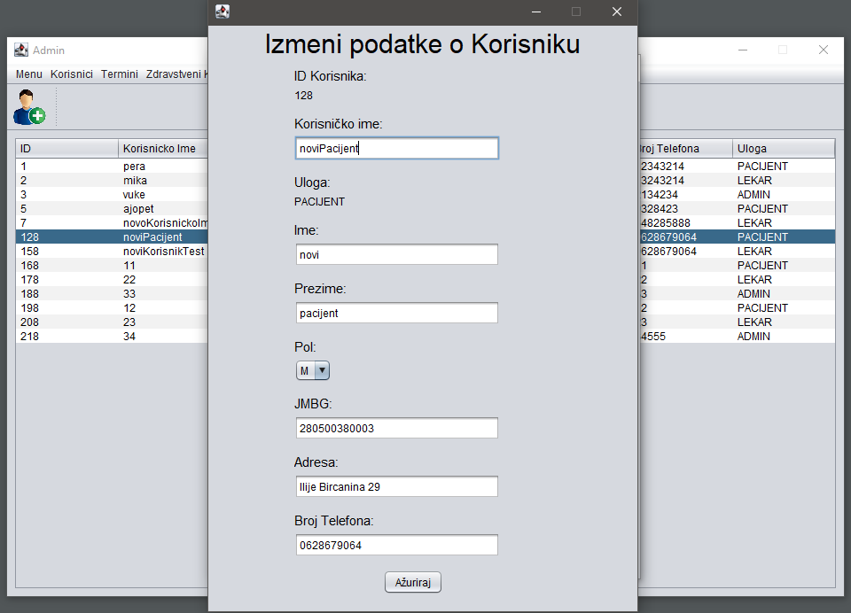
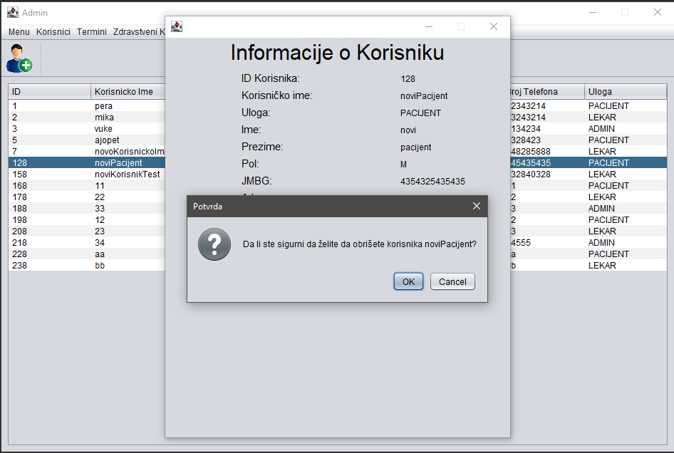
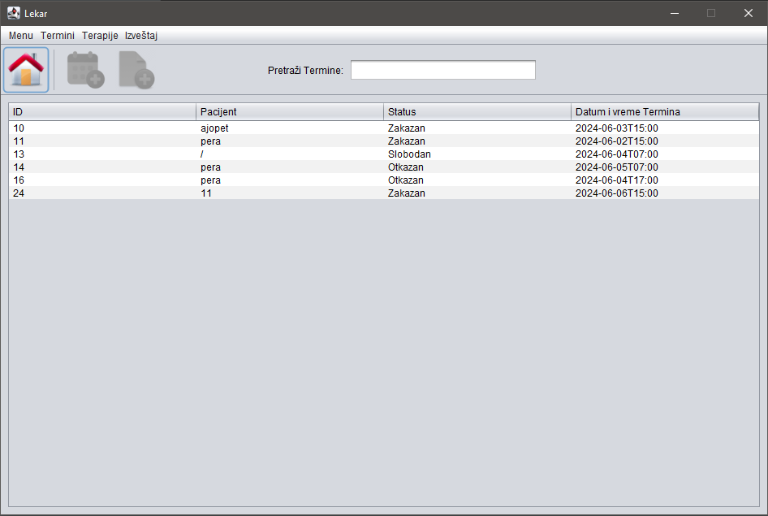
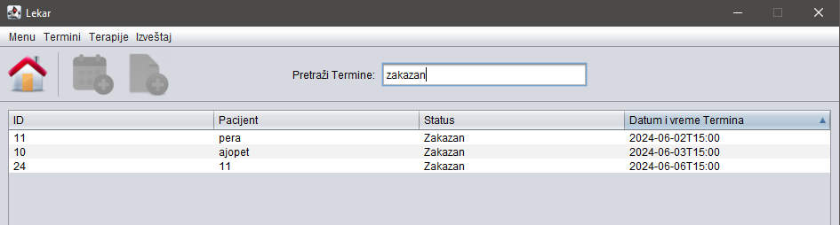
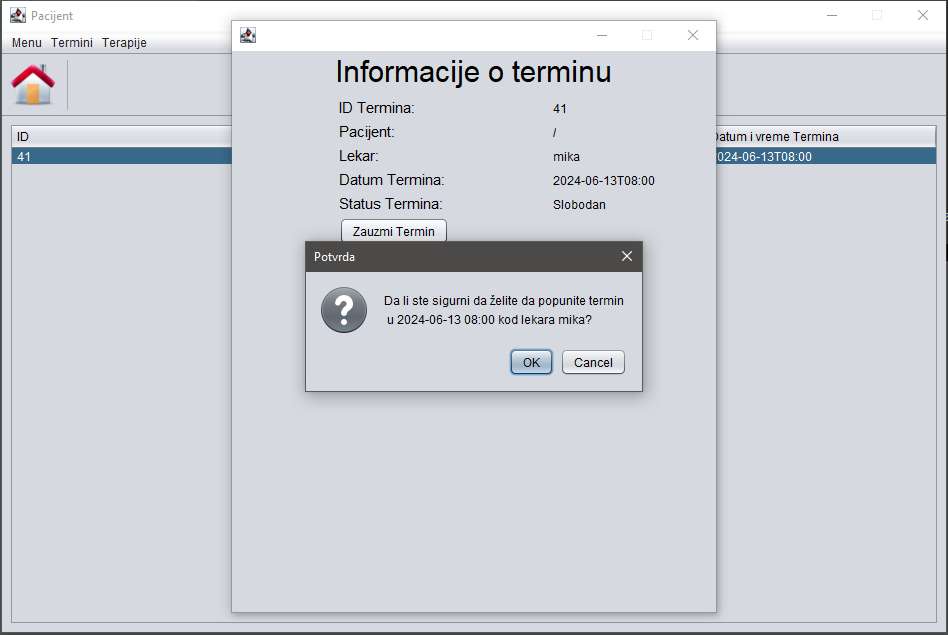

# SR08-2023-UOP
# Health Care Java Desktop Application

## "Introduction to Object Oriented Programming" class project, second semester

### Administrator
- Access to all entities and actions except creating appointments
- Viewing and canceling appointments
- Adding new users (administrator, patient, doctor)

### Patient
- Viewing available, scheduled, and canceled appointments
- Booking available appointments
- Canceling scheduled appointments (before the appointment date)
- Viewing prescribed therapies

### Doctor
- Creating and updating appointments and therapies
- Scheduling and canceling appointments (before the appointment date)
- Viewing own appointments
- Generating reports for specific time intervals

 
 
 
 
 
 
 
 
 
